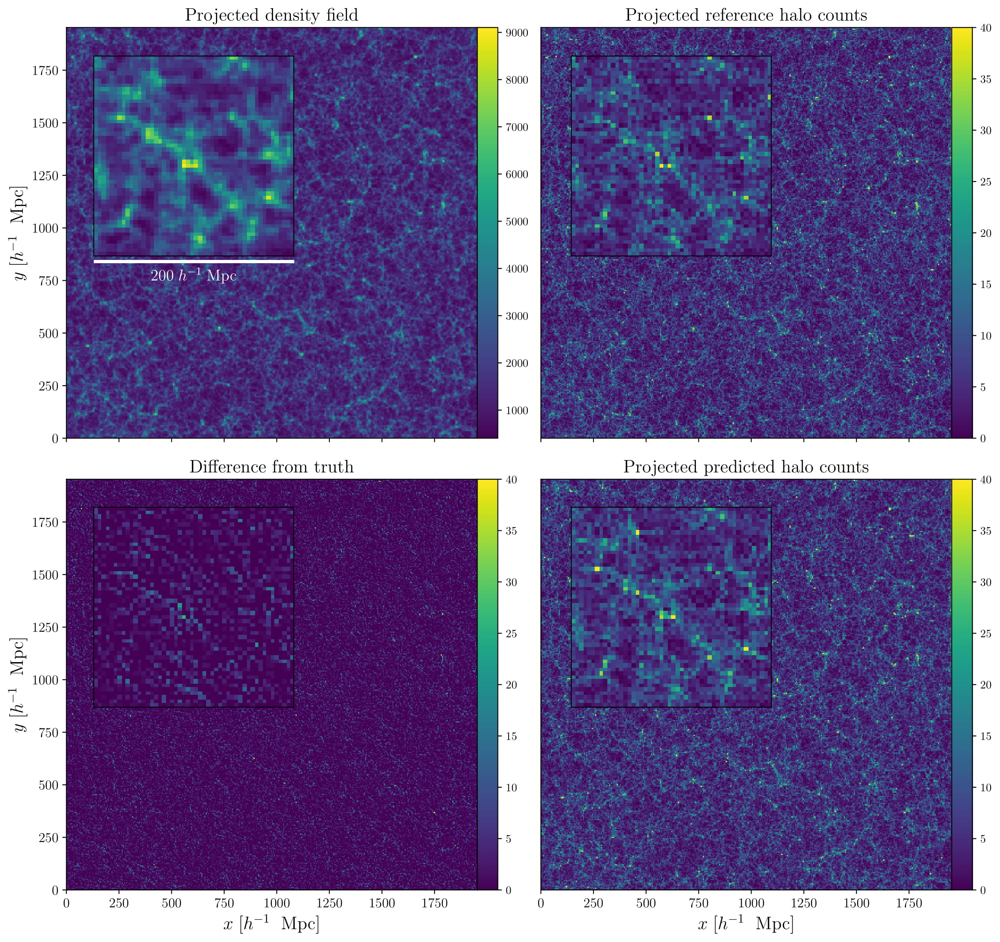

# halo_painting
**Predicts 3D halo distributions from dark matter simulations using a physically motivated Wasserstein mapping network**

#### The network architecture, training methodology and results are detailed in:  
"*Painting halos from cosmic density fields of dark matter with physically motivated neural networks*,"  
Doogesh Kodi Ramanah, Tom Charnock, Guilhem Lavaux [[arXiv:1903.10524]](https://arxiv.org/abs/1903.10524)

#### Note:  
1) The notebook `wasserstein_halo_painting_network.ipynb` contains an in-depth and stepwise description of the network implementation and training;  
2) Please cite the above paper if you make use of our code;  
3) The `network_learning_movie.mp4` depicts the network predictions for a given thick slice of dark matter density field, as a function of weight updates, and provides a visualization of the network learning progress.

